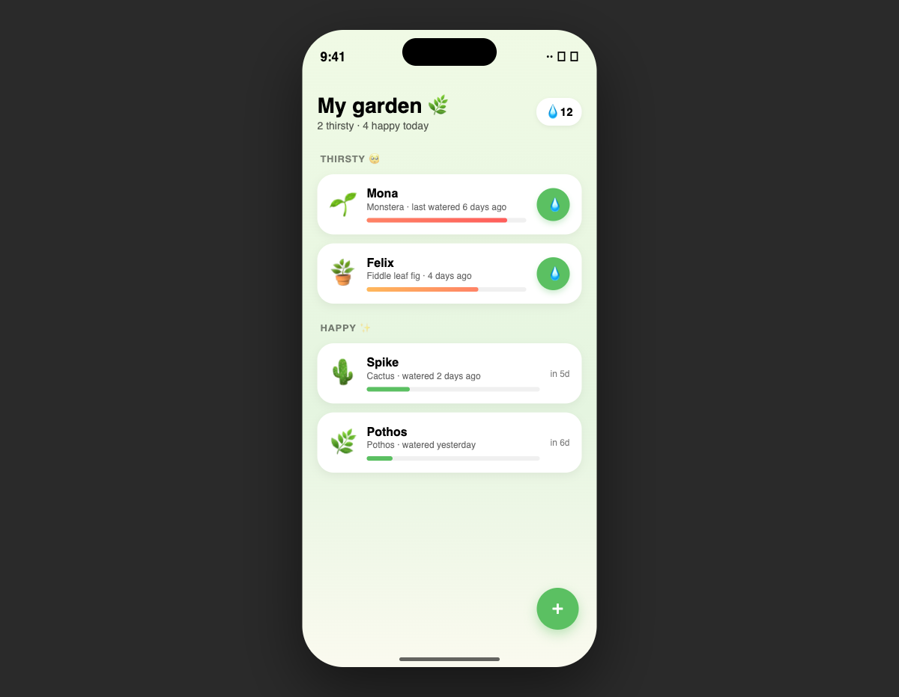
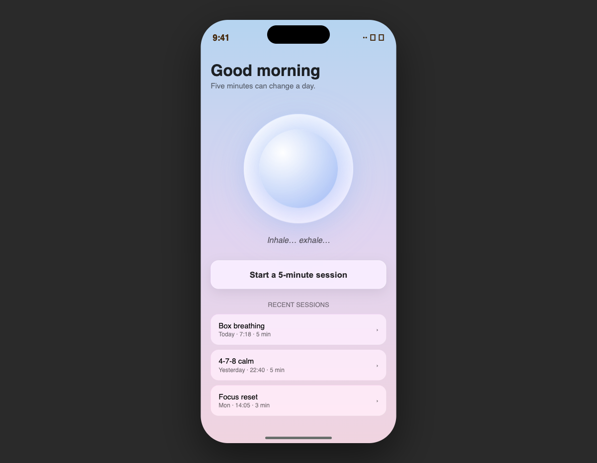
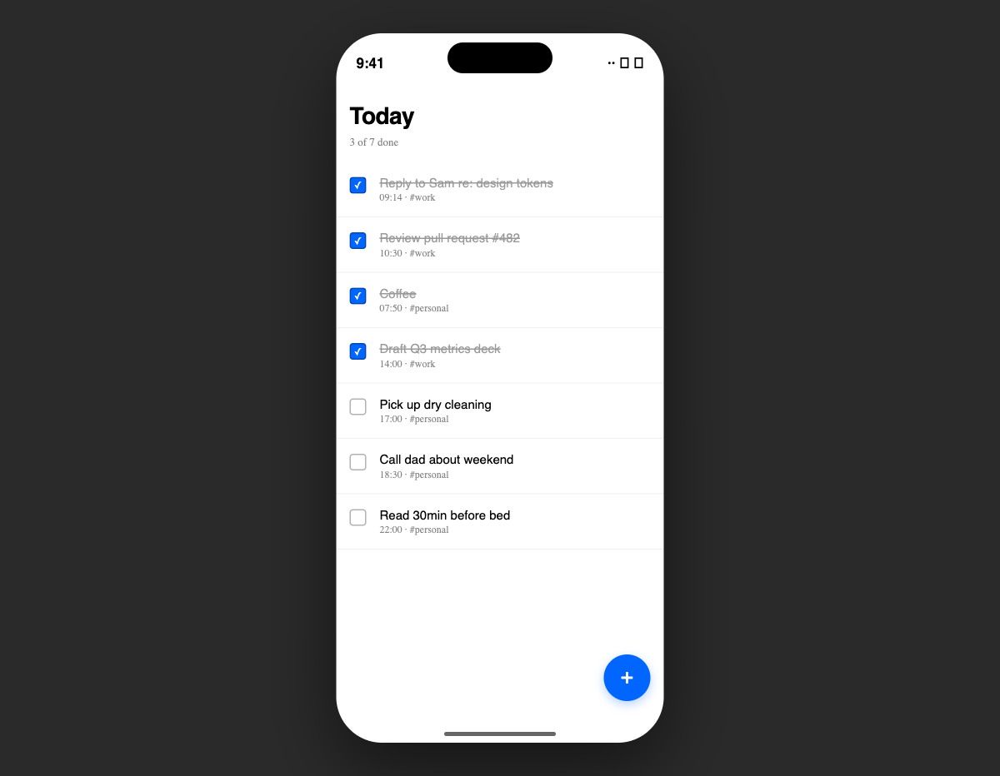
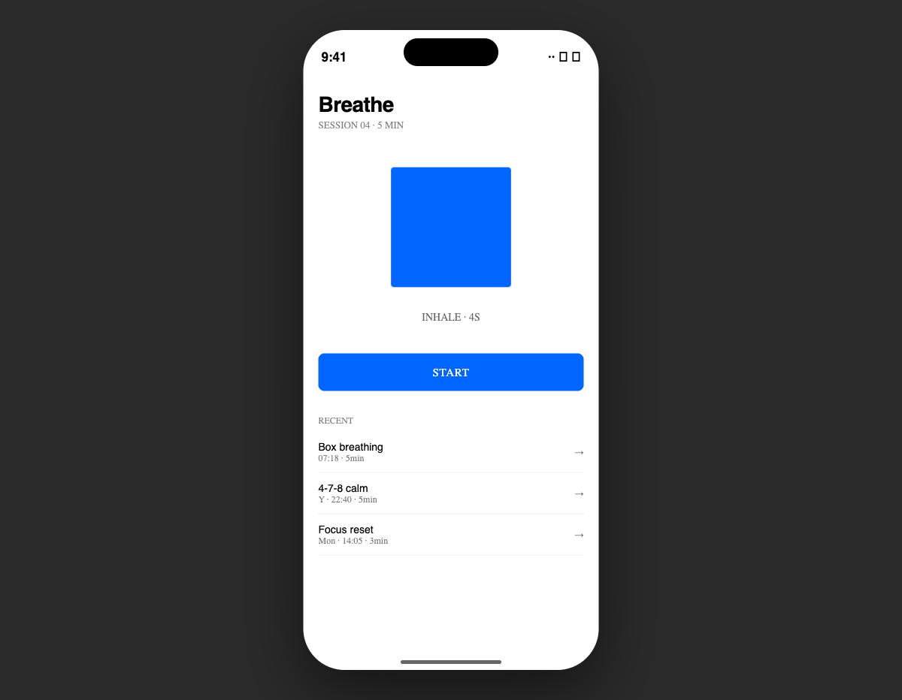
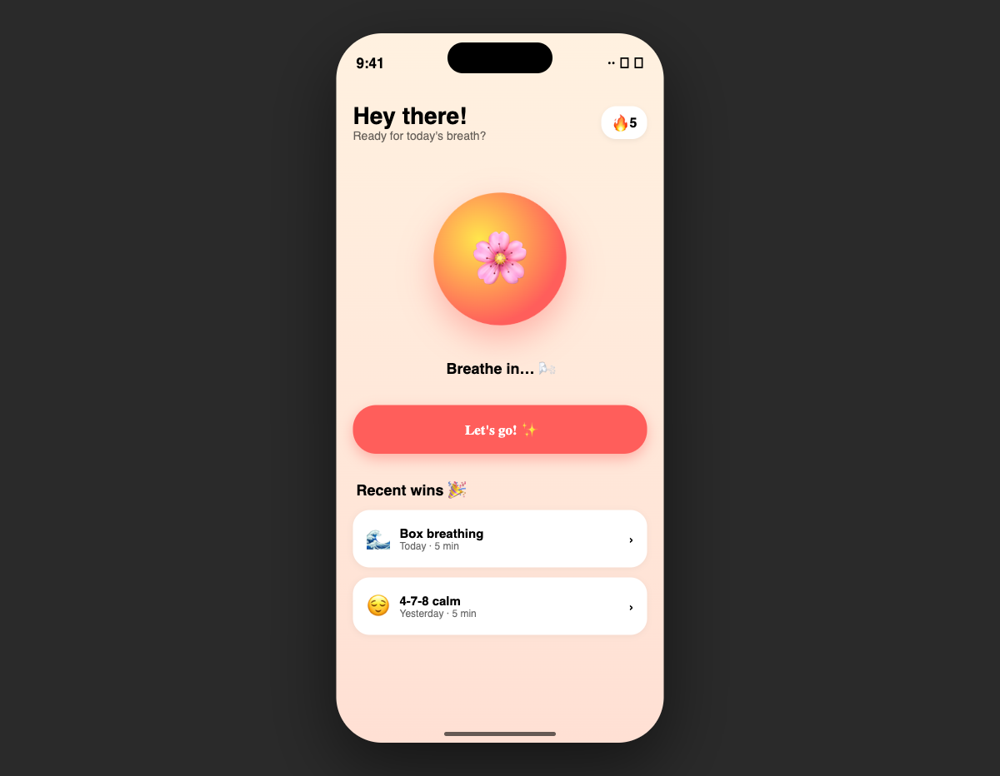
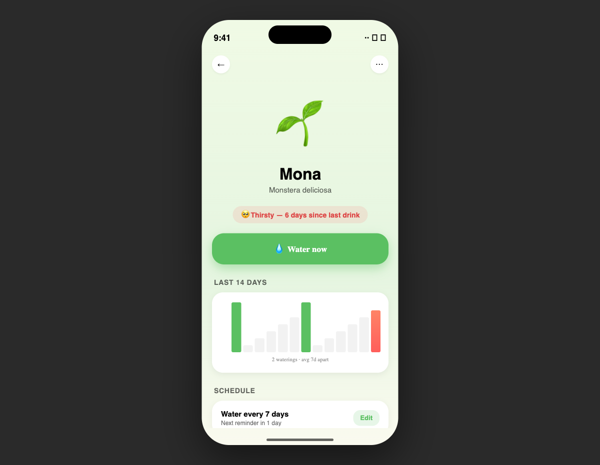
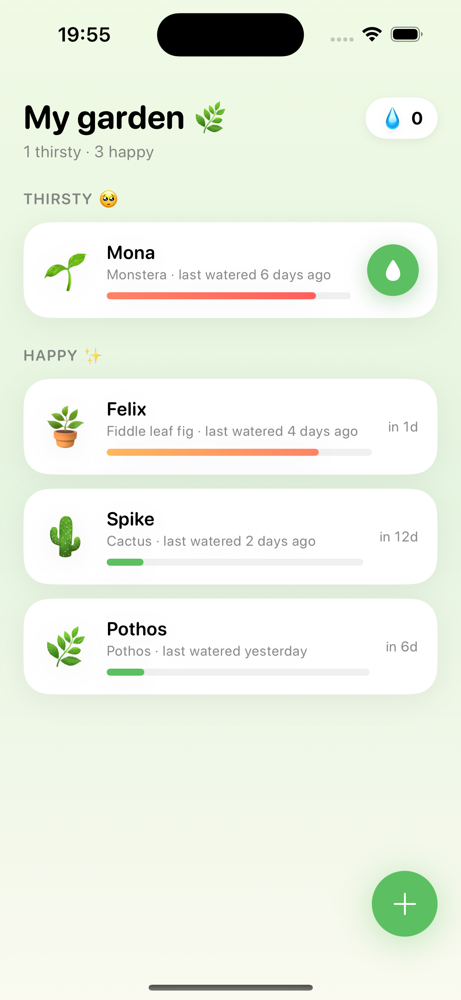

# 🌊 liquid-ios

> **Claude Code için motion-validated SwiftUI.** Üç tasarım DNA'sı, interaktif HTML prototiplerle önceden onaylanır; sonra onayladığın motion kaybolmadan production SwiftUI olarak materyalize edilir.

[](LICENSE) [](CHANGELOG.md) [](#) [](https://claude.com/claude-code)

---

<p align="center">
  
  &nbsp;
  
  &nbsp;
  
</p>

<p align="center">
  <em>Aynı plugin. Üç farklı app. Üç farklı tasarım DNA'sı — seçilmiş, tahmin edilmemiş.</em>
</p>

---

## 🤔 Bu plugin neden var?

Çoğu "AI ile iOS app yap" aracı **teknik olarak doğru, görsel olarak jenerik SwiftUI** üretiyor. Butonlar var. Listeler kayıyor. Renkler muğlak şekilde markaya uygun. Motion ise... modelin içinden ne geçtiyse.

**Zor olan kısım kod değil, tasarım niyeti.** Akıcı motion, özgün etkileşimler, tutarlı bir görsel dil — bunlar kazara olmaz. Üç şey gerektirir:

1. **Seçilmiş bir tasarım dili** (bu app'in karakteri ne?)
2. **Taahhütten önce doğrulama** (motion iyi hissettiriyor mu, kilitlemeden önce?)
3. **Disiplinli uygulama** (her yeni ekran DNA'ya sadık kalsın — sapma yok)

`liquid-ios` bu üçünü de zorlayan bir Claude Code plugin'i. Proje başlatırsın; plugin kategorini araştırır, bir stack ve tasarım DNA'sı önerir, **üç interaktif HTML prototipi** üretir (tarayıcıda motion'ı gerçekten hissedersin), sonra onayladığın DNA'ya sadık SwiftUI yazar — prototipteki her animasyon primitifinin SwiftUI'de birebir sadakatle üretilebilen karşılığı vardır.

---

## ✨ Ne sunar?

### Dört skill, tek workflow

| Skill | Ne zaman… | Ne üretir |
|---|---|---|
| `ios-design` *(router)* | Nereden başlayacağını bilmiyorsan | Durumu inceler, capability card basar, doğru sub-skill'e yönlendirir |
| `ios-design:init` | Sıfırdan yeni bir iOS app başlatıyorsan | 3 interaktif HTML prototipi → DNA seçimi → Xcode scaffold + ilk commit |
| `ios-design:feature` | Yeni bir ekran / view / akış ekliyorsan | DNA içinde tek prototip → SwiftUI implementation |
| `ios-design:tweak` | Motion / spacing / renk gibi küçük bir ayar yapıyorsan | Odaklı düzenleme + DNA uyumluluk kontrolü |

### Plugin'i ayıran üç davranış

1. **Kendini tanıtan capability card'lar** — her skill ilk aktivasyonda *ne yaptığını* ve *neyle güçlendiğini* açıkça söyler. Ne tetiklendiğini tahmin etmek yok.
2. **A/B/C config yerine araştır-ve-öner** — skill app kategorini araştırır, kararları (min iOS, persistence, mimari, DNA) gerekçeli olarak önerir. Kabul edersin, override edersin, veya alternatif istersin. Çoktan seçmeli değil.
3. **Companion plugin farkındalığı** — eksik yardımcı plugin'leri/MCP'leri (`superpowers`, `context7`, `playwright`, `serena`) tespit eder, kayıp değeri açıklar ama çalışmayı engellemez.

---

## 🎬 İş başında — üç app, tek plugin

### Senaryo 1 — Productivity aracı → Editorial Crisp

**Prompt:**
> "Yeni bir iOS app yapmak istiyorum: basic bir todo app. Hızlı task yönetimi."

**Plugin ne yaptı:**
- Productivity kategorisini araştırdı → **iOS 17** (mass-market) + **Editorial Crisp** DNA önerdi (sharp ease, monospace timestamps, minimal süs — Linear/Notion estetiği).
- 3 prototip üretti; kullanıcı Editorial Crisp'i onayladı.
- `Sources/`'u scaffold etti: `TodoTask` model, `TodoListService` (`@Observable @MainActor`), `TodayView` — `List` + checkbox'lar + 200ms easeInOut toggle.

<p align="center">
  
  
</p>

**Ana çıkarım:** SwiftUI'de hardcoded magic number yok. Her renk, her spacing, her animasyon süresi kilitli design system'den okunuyor.

---

### Senaryo 2 — Meditation app → Liquid Native

**Prompt:**
> "Breathe — günde 5 dakikalık nefes egzersizleri rehberi. Premium meditation kategorisi."

**Plugin ne yaptı:**
- Meditation/wellness'ı araştırdı → **iOS 26** (Liquid Glass faydası premium için net) + **Liquid Native** DNA önerdi (derinlik, glassmorphism, yavaş spring transitions).
- 3 prototip üretti — sakin/premium hisse en uygun olan Liquid Native'di.
- `BreathSession` SwiftData model, `SessionLog`, `TodayView`'ı scaffold etti: `phaseAnimator` ile sürekli nefes alan breathing orb, `.glassEffect()` ile sarmalanmış (iOS<26 için `.ultraThinMaterial` fallback).

<p align="center">
  
  
  
</p>

**Ana çıkarım:** Aynı app fikri, üç DNA — üç tamamen farklı his. Liquid Native seçildi çünkü klinik (Editorial) meditation'a ters, zıplayıcı (Playful) da sakinliğe ters. Plugin'in önerisi kategori sezgisiyle örtüştü.

---

### Senaryo 3 — Karakterli lifestyle app → Playful Character

**Prompt:**
> "Sprout — ev bitkileri sulama hatırlatıcısı. Plant parents için karakterli bir app."

**Plugin ne yaptı:**
- Plant care app'leri araştırdı → **iOS 17** (mass-market) + **Playful Character** DNA önerdi (overshoot, sıcak gradyanlar, karakter emoji wiggle).
- `Plant` modeli (thirst hesaplama dahil), `Garden` observable service, `GardenView` (`THIRSTY/HAPPY` section'ları + animasyonlu thirst bar'lar + water tap'te bounce), `AddPlantSheet` (emoji picker grid), `PlantDetailView` (watering history `Charts` ile) scaffold etti.

<p align="center">
  
  
</p>

**Ana çıkarım:** Gerçek bir app yüzeyi — çoklu ekranlar, navigation, gamification (drop counter), data flow — hepsi prototip-önce workflow'uyla üretildi, **sıfır generic AI hissi**.

---

## 🔬 Gerçek kanıt — prototip vs. iOS Simulator

Plugin'in asıl iddiası: *"prototipte gördüğün tam olarak iOS'ta aldığın olur."* Bu bölüm o iddiayı kanıtlıyor.

Sprout uygulamasının `Sources/` klasörü [XcodeGen](https://github.com/yonaskolb/XcodeGen) ile `.xcodeproj`'e dönüştürüldü, `xcodebuild` ile iOS 17+ hedefi için derlendi, iPhone 16 (iOS 18.3) simulatoründe çalıştırıldı — hepsi komut satırından, tek bir oturumda.

<p align="center">
  
  &nbsp;&nbsp;&nbsp;
  
</p>

<p align="center">
  <em>Sol: <code>prototypes/playful-character.html</code> (tarayıcıda).<br>
  Sağ: aynı tasarım, gerçek SwiftUI olarak <code>iPhone 16 / iOS 18.3</code> simulatoründe çalışıyor.</em>
</p>

**Ne birebir korundu:**
- Cream-to-mint gradient arka plan
- "My garden 🌿" başlık + "N thirsty · M happy" subtitle
- THIRSTY / HAPPY section organizasyonu
- Plant card layout — emoji + name + species + thirst bar + water button (thirsty ise)
- Thirst bar rengi: kırmızı (thirsty) / turuncu (uyarı) / yeşil (healthy) — DNA kuralına uyarak
- Yeşil dairesel water button + FAB
- Drop counter pill
- `phaseAnimator` ile sürekli plant emoji wiggle (screenshot'ta yakalanamıyor, runtime'da görünür)

**Üretim akışı — komut başına:**
```bash
cd /tmp/sprout-app-test
xcodegen generate                               # project.yml → Sprout.xcodeproj
xcodebuild -project Sprout.xcodeproj \
  -scheme Sprout \
  -destination "platform=iOS Simulator,name=iPhone 16" \
  CODE_SIGNING_ALLOWED=NO build                 # BUILD SUCCEEDED
xcrun simctl install booted /path/to/Sprout.app
xcrun simctl launch booted com.liquidios.sample.sprout
xcrun simctl io booted screenshot out.png       # yukarıdaki simulator screenshot
```

**Gerçek test'ten çıkan bulgu (v0.1.1'de düzeltilecek):**
Plugin ilk denemede üretilen SwiftUI'da `.spring(response: 0.4, damping: 0.6)` kullanmıştı — SwiftUI bu imzayı `dampingFraction` olarak bekliyor. DNA konseptinde "damping" kullanmamız okunabilirliği artırıyor ama kod üretirken `dampingFraction`'a çevrilmesi gerekiyor. `references/motion-fidelity-rules.md` bu mapping'i açıkça belgeliyor (v0.1.1+).

> Bu akışı kendin de tekrarlayabilirsin: XcodeGen + Xcode 16.2+ yeterli. Sprout test projesi bu repo'da yok — plugin **senin** projen için aynı şeyi üretir.

---

## 🚀 Hızlı başlangıç

```bash
# Clone
git clone https://github.com/coltrosetech/liquid-ios.git
cd liquid-ios

# Local symlink ile install (Claude Code ~/.claude/plugins/ içinde keşfeder)
mkdir -p ~/.claude/plugins/local
ln -snf "$(pwd)" ~/.claude/plugins/local/liquid-ios

# Claude Code'u yeniden başlat (Cmd+Q, aç)
```

Boş bir dizinde yeni bir Claude Code session açıp:

```
Sen: Yeni bir iOS app yapmak istiyorum: <fikrin>
```

Router aktive olur, capability card basar, bir stack ve DNA önerir, gerisini seninle yürütür.

> Tüm install yolları (marketplace, GitHub, vb.) → [`INSTALL.md`](INSTALL.md).
> Detaylı prompt rehberi → [`USAGE.md`](USAGE.md).

---

## 🧭 Nasıl çalışır (workshop akışı)

```
Gün 1
  Sen:    "Yeni iOS app: <fikir>"
  Plugin: → ios-design:init aktive olur
          → Capability card basılır
          → Stack araştırması + öneri (gerekçeli)
          → 3 DNA prototipi yerel HTTP server üzerinden tarayıcıda açılır
          → Birini seçersin (veya hibrit)
          → .design/design-system.json + DESIGN_DNA.md kalıcılaşır
          → Xcode scaffold + ilk commit

Gün 1 (sonra)
  Sen:    "Today screen'e <feature> ekle"
  Plugin: → ios-design:feature aktive olur
          → DNA context otomatik yüklenir
          → DNA içinde tek prototip render edilir
          → Onaylarsın
          → SwiftUI üretilir (motion prototipten birebir mapping)
          → simplify pass → verification gate → commit

Gün 2
  Sen:    "<X> animasyonu daha yumuşak olsun"
  Plugin: → ios-design:tweak aktive olur
          → İsteği DNA'ya karşı diff'ler
          → DNA'dan sapıyorsa: "tek seferlik mi, DNA revize mi?" diye sorar
          → Uygular + commit
```

---

## 🎨 DNA kataloğu (3 opinionated default)

| DNA | Karakter | Motion imzası | Tipik kullanım |
|---|---|---|---|
| **Liquid Native** | Apple HIG + iOS 26 Liquid Glass — derinlik, parıltı, katmanlı geçişler | `spring(response: 0.5, damping: 0.8)`, matchedGeometryEffect ağırlıklı | Premium tüketici, içerik ağırlıklı, Apple ekosistemi (journal, reader, meditation) |
| **Editorial Crisp** | Linear/Notion estetiği — net çizgiler, keskin easing, monospace aksan | `easeInOut` 200ms, kısa transitions, dikkat dağıtmaz | Productivity, dev tools, B2B, editorial app'ler |
| **Playful Character** | Arc/Duolingo enerjisi — overshoot, bounce, renk patlamaları, mikro-kutlamalar | `spring(response: 0.4, damping: 0.6)`, TimelineView, haptic-zengin | Tüketici eğlence, gamified, social, lifestyle |

Custom DNA'lar base preset'ten parametre tweak'iyle türetilir (örn. "Liquid Native ama daha sakin motion" → `liquid-native-calm`).

---

## ⚙️ Default stack (araştır-ve-öner çıktısı)

Init akışı bunları default olarak önerir; hepsini kabul edersin, bir kısmını kabul edersin veya override edersin:

| Karar | Default | Ne zaman değişir |
|---|---|---|
| Min iOS | 26 | Geniş cihaz erişimi gerekiyorsa (mass-market) 17'ye düşürülür |
| Bootstrap | Vanilla Xcode (solo) / Tuist (takım) | Modül sayısı + takım büyüklüğü |
| Test framework | Swift Testing (iOS 18+) | Min iOS < 18 ise XCTest'e düşer |
| Concurrency | Swift 6 strict | Kilitli |
| State | `@Observable` + `@MainActor` | Kilitli (iOS 17+ standart) |
| Persistence | SwiftData | Min iOS < 17 ise Core Data'ya düşer |
| Architecture | MVVM + Observable services | Çok takımlı proje için TCA önerilir |
| DI | Manual constructor injection | YAGNI — framework sadece gerçekten gerekirse |
| Navigation | NavigationStack + path binding | iOS 16+ standart |

Seçilen tüm değerler `.design/DESIGN_DNA.md#Stack Decisions` içine gerekçeleriyle birlikte yazılır.

---

## 🔗 `superpowers` ile kompozisyon

`liquid-ios` planning, simplification, verification mantığını yeniden yazmıyor — [`superpowers`](https://github.com/anthropic-experimental/superpowers)'a net tanımlı gateway noktalarında **delegate** ediyor:

| ios-design skill | Gateway | Çağrılan superpowers skill |
|---|---|---|
| `init` | Capability card sonrası | `brainstorming` (yakın zamanlı spec varsa atlanır) |
| `init` | DNA seçimi sonrası | `writing-plans` |
| `init` | İlk commit öncesi | `verification-before-completion` |
| `feature` | Prototip tasarımı öncesi | `brainstorming` (sadece scope belirsizse) |
| `feature` | Prototip onayı sonrası | `writing-plans` (> 3 adım gerekiyorsa) |
| `feature` | Implementation sırasında (sadece logic) | `test-driven-development` |
| `feature` | Implementation sonrası | `simplify` |
| `feature` | Commit öncesi | `verification-before-completion` |
| `tweak` | Değişiklik öncesi | `systematic-debugging` (bug kaynaklıysa) |
| `tweak` | Değişiklik sonrası | `simplify` |

`superpowers` kurulu değilse gateway'ler sessizce atlanır ve bir uyarı basılır. **Kalite belirgin şekilde düşer** — superpowers'ı kur.

---

## 🧰 Companion plugin'ler / MCP'ler

Tam güç için önerilir. Herhangi biri eksikse plugin düzgün şekilde degrade olur:

| Plugin / MCP | Kritiklik | Eksikse kaybolan |
|---|---|---|
| [`superpowers`](https://github.com/anthropic-experimental/superpowers) | **Essential** | Composition gateway'leri atlanır → düşük kaliteli planlar, KISS pass yok, verification yok |
| `context7` (MCP) | **Essential** | Apple docs training cutoff'a takılı kalır |
| `playwright` (MCP) | Recommended | Prototipler manuel tıklanan `file://` yolları olarak açılır |
| `serena` (MCP) | Recommended | Tweak skill semantic navigation yerine tüm dosyaları okur |
| `claude-md-management` | Optional | CLAUDE.md bakımı manuel |
| `frontend-design` | Optional | Prototipler biraz daha "AI-generic" görünebilir |

---

## 🛣️ Yol haritası

- [x] **v0.1.0** — İlk sürüm: 4 skill, 3 DNA, design system persistence, motion fidelity kuralları
- [x] **v0.1.1** — Local HTTP server script'leri (playwright `file://` limitasyonunu çözer)
- [ ] **v0.2** — `ios-design:audit` — Mevcut kodda DNA sapması tespiti
- [ ] **v0.3** — `ios-design:storekit` — IAP / abonelik akışları, DNA uyumlu paywall tasarımı
- [ ] **v0.4** — `ios-design:push` — Push notification UI pattern'leri + permission flow'ları
- [ ] **v0.5** — `ios-design:appstore` — App Store Connect entegrasyonu, DNA'ya göre screenshot üretimi, submission checklist
- [ ] **v1.0** — `ios-design:backend-integration` — Networking pattern'leri, auth, error/loading state DNA uygulaması

Detaylı sürüm geçmişi için → [`CHANGELOG.md`](CHANGELOG.md).

---

## 📚 Dokümantasyon

| Dosya | İçerik |
|---|---|
| [`USAGE.md`](USAGE.md) | Prompt rehberi — hangi kelimeler hangi skill'i tetikler, iyi/kötü prompt örnekleri, yaygın hatalar |
| [`INSTALL.md`](INSTALL.md) | Install yolları (local symlink, marketplace, GitHub) + smoke test |
| [`CHANGELOG.md`](CHANGELOG.md) | Her sürümün gerekçesiyle birlikte geçmişi |
| [`docs/superpowers/specs/`](docs/superpowers/specs/) | Orijinal tasarım spesifikasyonu (her mimari karar için derinlemesine gerekçe) |
| [`docs/superpowers/plans/`](docs/superpowers/plans/) | Implementation plan (15 task, subagent-driven development ile yürütüldü) |
| [`tests/manual-scenarios.md`](tests/manual-scenarios.md) | 10 manuel sürüm-doğrulama senaryosu |

---

## 🛠️ Repo yapısı

```
liquid-ios/
├── plugin.json              # Manifest
├── README.md / USAGE.md / INSTALL.md / CHANGELOG.md / LICENSE
├── skills/                  # 4 skill (router, init, feature, tweak)
│   ├── ios-design/SKILL.md
│   ├── ios-design-init/SKILL.md
│   ├── ios-design-feature/SKILL.md
│   └── ios-design-tweak/SKILL.md
├── references/              # Progressive-disclosure bilgi tabanı
│   ├── motion-fidelity-rules.md   # CSS↔SwiftUI whitelist (bedrock)
│   ├── dna-prototypes.md           # 3 default DNA + token default'ları
│   ├── superpowers-composition.md  # Skill başına gateway haritası
│   └── companion-plugins.md        # Detection kuralları + kritiklik
├── templates/               # Runtime'da substitute edilen iskeletler
│   ├── design-system.template.json
│   ├── DESIGN_DNA.template.md
│   └── prototype-shell.html
├── prototypes/              # Default DNA prototip HTML'leri (motion-fidelity-validated)
│   ├── liquid-native.html
│   ├── editorial-crisp.html
│   └── playful-character.html
├── scripts/                 # Playwright için local HTTP server
│   ├── serve-prototypes.sh
│   └── stop-prototype-server.sh
├── hooks/                   # Yaşam döngüsü hook'ları
│   └── session-start.sh     # Capability-card flag'lerini session başına sıfırlar
├── tests/                   # Manuel sürüm-doğrulama senaryoları
│   └── manual-scenarios.md
└── docs/
    ├── screenshots/         # Görsel kanıt (3 app × 3 DNA)
    └── superpowers/         # Spec + implementation plan
```

> **İsimlendirme notu:** GitHub repo adı branding için `liquid-ios`. Plugin'in manifest adı (`ios-design`) ve skill ID'leri (`ios-design:init`, `ios-design:feature`, vb.) teknik amacı yansıtır. Bu ayrım bilinçlidir.

---

## 🙏 Teşekkürler

- Claude Code'da `superpowers` plugin'i ile baştan sona yazıldı (brainstorming → writing-plans → subagent-driven-development → verification → finishing-a-development-branch).
- Mevcut iOS skill ekosisteminden ilham alındı ([`avdlee/swiftui-agent-skill`](https://github.com/AvdLee/SwiftUI-Agent-Skill), [`twostraws/swift-agent-skills`](https://github.com/twostraws/swift-agent-skills), [`dpearson2699/swift-ios-skills`](https://github.com/dpearson2699/swift-ios-skills)) — `liquid-ios` bu bilgi skill'lerini workflow-önce, design-DNA-kilitli bir yaklaşımla tamamlıyor.

---

## 📜 Lisans

MIT — [`LICENSE`](LICENSE).

---

<p align="center">
  <em>Niyetle inşa edildi. Disiplinle üretildi. Prototipten production'a yolculukta hayatta kalan motion ile teslim edildi.</em>
</p>
